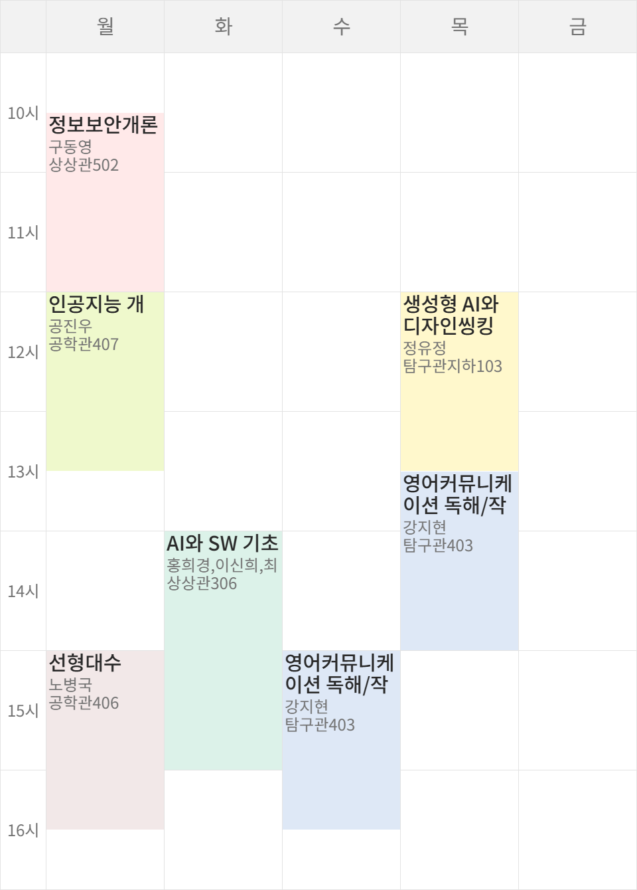
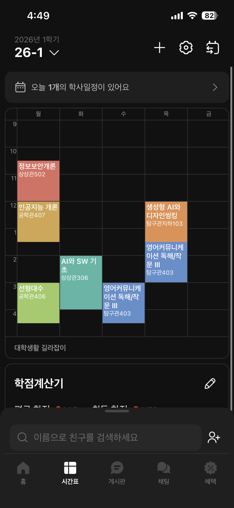
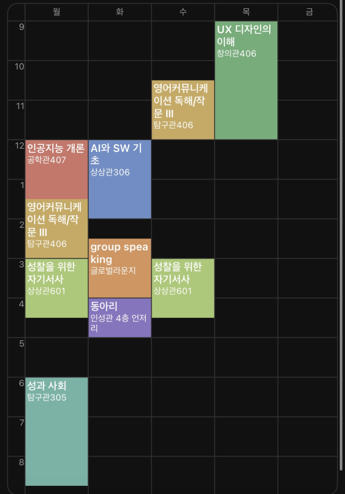
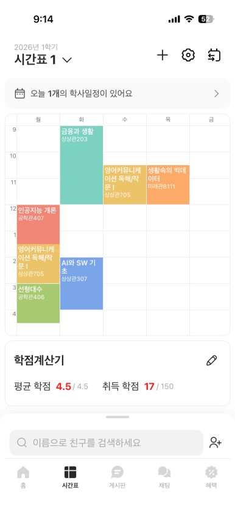

# 한성대학교 비교과 프로그램 도우미

[한성대학교 비교과 프로그램 사이트](https://hsportal.hansung.ac.kr/)의 비교과 프로그램 정보를 수집하고, 학생의 수업 시간표와 비교해 참여 가능성이 높은 프로그램을 추출하는 FastAPI 기반 웹 서비스입니다. 사용자는 시간표 이미지를 업로드하고, 서비스는 VLM으로 수업 정보를 JSON으로 추출한 뒤 편집 가능한 시간표 화면과 추천 결과 화면을 제공합니다.

테스트 배포 페이지: [한성대학교 비교과 프로그램 도우미](https://hsportal-helper.onrender.com/)

## 핵심 목적

- 시간표 이미지에서 수업명, 요일, 시작/종료 시간을 구조화합니다.
- HS Portal 비교과 프로그램 목록과 상세 정보를 로컬 JSON으로 준비합니다.
- 수업 시간과 비교과 프로그램 운영 일정을 비교해 참여 가능 여부를 분류합니다.
- 학생이 확인해야 할 프로그램을 `참여 가능`, `확인 필요`, `참여 불가`로 나눠 보여줍니다.

## 프로젝트 기능

- FastAPI 단일 서버에서 API와 정적 프론트엔드를 함께 제공
- 서버 시작 직후와 설정된 주기마다 HS Portal 비교과 데이터 백그라운드 수집/갱신
- 시간표 이미지 업로드, 미리보기, 영역 크롭, VLM 분석
- 추출된 시간표를 드래그 앤 드롭으로 수정하는 편집 화면
- 추천 API 호출 후 프로그램 목록, 검색, 필터, 상세 모달 제공
- Qwen OpenAI-compatible Vision API 연동

## 팀원 역할 분담

- **박민재**: FastAPI 앱 구성과 실행 환경을 결정하고, 교내 사이트 비교과 데이터 수집 및 갱신 과정과 Qwen Vision API 연동을 구현했습니다. `main.py`, `backend/hsportal`, `llm`, `util`을 통해 크롤러, LLM 요청/응답 검증, 이미지 전처리, 로깅과 환경 변수 구성을 맡았습니다. 
- **조민규**: `frontend/public`의 정적 프론트엔드를 구현했습니다. 시간표 이미지 업로드와 크롭 진입, 추출된 수업 블록 편집, 추천 결과 목록과 상세 모달 등 프론트엔드 사용 경험을 담당했습니다. 
- **채민준**:  `backend/recommendation.py`를 중심으로 수업 시간표와 비교과 프로그램 일정을 비교하는 추천 알고리즘을 개발했습니다. 일정 유형 분류, 수업 충돌 검사, 참여 가능/확인 필요/참여 불가 판정, 점수 계산과 검사 메시지 구성을 담당했습니다. 

## 시연 및 예시

[시연 영상 보기](docs/assets/시연영상.mp4)

### 예시 시간표 이미지

| 예시 1 | 예시 2 | 예시 3 | 예시 4 |
| --- | --- | --- | --- |
|  |  |  |  |

## 프로젝트 구조

```text
/
├─ main.py
│  └─ FastAPI 앱 생성, 라우터 등록, 정적 프론트엔드 마운트, 크롤러 시작/종료 관리
├─ backend/
│  ├─ api/
│  │  └─ heartbeat, hsportal, timetable, recommendations API 라우터
│  ├─ hsportal/
│  │  └─ HS Portal 목록/상세 크롤링, HTML 파싱, JSON 저장
│  ├─ config.py
│  └─ recommendation.py
├─ frontend/
│  └─ public/
│     ├─ index.html, app.js, styles.css
│     ├─ timetable/
│     └─ recommendations/
├─ llm/
│  ├─ tasks/
│  │  └─ 시간표 추출 task 정의
│  ├─ config.py
│  ├─ media.py
│  ├─ qwen_client.py
│  ├─ schemas.py
│  └─ service.py
├─ util/
│  └─ 로깅 설정과 이미지 전처리 공통 유틸리티
├─ docs/
│  ├─ api.md
│  ├─ recommendation.md
│  ├─ prompts.md
│  └─ assets/
├─ requirements.txt
├─ pyproject.toml
└─ .env.example
```

## 디렉터리별 기능

| 디렉터리 | 주요 책임 | 직접 연동 대상 |
| --- | --- | --- |
| `backend` | API 라우팅, 비교과 데이터 조회, HS Portal 크롤링 데이터 관리, 추천 계산 | `main.py`, `llm`, `frontend` |
| `frontend` | 사용자 화면, 이미지 업로드/크롭, 시간표 편집, 추천 결과 UI, 브라우저 상태 저장 | `backend` API |
| `llm` | Qwen Vision API 호출, 이미지 payload 구성, JSON 응답 파싱/검증 | `backend.api.timetable`, `util` |
| `util` | 앱 전역 로깅, 이미지 포맷 검사와 WebP 정규화 | `main.py`, `llm.media` |
| `docs` | API 명세, 추천 기준, AI 프롬프트 사용 정리 문서 | README, 제출 문서 |

## 실행 흐름

1. `main.py`가 FastAPI 앱을 만들고 `/api` 라우터와 `frontend/public` 정적 파일을 등록합니다.
2. 앱 lifespan 시작 시 HS Portal 크롤러 주기 실행 task가 백그라운드로 예약됩니다.
3. 저장된 `backend/hsportal/programs.json`이 없거나 수집 정책이 바뀌면 전체 수집을 수행합니다.
4. 저장 데이터가 있으면 목록 첫 페이지의 최신 프로그램 ID를 cursor와 비교해 필요한 경우에만 증분 수집합니다.
5. 수집 1회가 끝나면 `HSPORTAL_CRAWL_INTERVAL_HOURS` 값만큼 대기한 뒤 같은 갱신 작업을 반복합니다.
6. 사용자가 시간표 이미지를 업로드하면 `/api/timetable/extract`가 이미지를 검증하고 WebP로 정규화합니다.
7. `llm` 계층이 Qwen Vision API에 시간표 추출 task를 요청하고 `TimetableExtractionResult`로 검증합니다.
8. 프론트엔드는 추출된 시간표를 `sessionStorage`에 저장하고 `/timetable/` 편집 화면으로 이동합니다.
9. 편집이 끝나면 `/api/recommendations`가 수업 시간과 비교과 프로그램 일정을 비교합니다.
10. 결과는 점수순으로 정렬되고 `/recommendations/` 화면에서 검색, 필터, 상세 확인이 가능합니다.

## 상세 문서

- [API 명세](docs/api.md)
- [추천 기준](docs/recommendation.md)
- [Qwen VLM API 설정](docs/qwen-api.md)
- [AI 프롬프트 사용 정리](docs/prompts.md)

## 설치

```bash
python -m venv .venv
.venv\Scripts\activate
pip install -r requirements.txt
```

macOS/Linux에서는 가상환경 활성화만 다음 명령을 사용합니다.

```bash
source .venv/bin/activate
```

## 환경 변수

```bash
copy .env.example .env
```

`.env`의 주요 값은 다음과 같습니다.

| 변수 | 설명 |
| --- | --- |
| `APP_NAME` | 서비스 이름 |
| `APP_ENV` | `dev` 또는 `prod`; dev에서는 이미지/LLM 디버그 로그가 더 자세함 |
| `LOG_LEVEL` | 콘솔 로그 레벨 |
| `HSPORTAL_CRAWL_INTERVAL_HOURS` | HS Portal 비교과 데이터 갱신 주기. 시간 단위이며 기본값은 `1` |
| `QWEN_API_KEY` | Alibaba Cloud Model Studio / DashScope API 키 |
| `QWEN_BASE_URL` | OpenAI-compatible endpoint |
| `QWEN_MODEL` | 사용할 Vision 모델명 |
| `QWEN_ENABLE_THINKING` | Qwen thinking 옵션 사용 여부 |
| `QWEN_THINKING_BUDGET` | thinking 사용 시 선택적 budget |
| `LLM_MAX_IMAGE_BYTES` | 업로드 이미지 최대 바이트 수 |

## 실행

```bash
python -m uvicorn main:app --reload
```

브라우저에서 `http://127.0.0.1:8000`으로 접속합니다.
