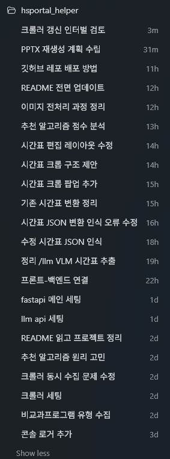

# AI 프롬프트 사용 정리

## 1. 사용 환경

본 프로젝트는 AI 코딩 도구인 Codex를 활용하여 개발했습니다. 사용한 모델 및 실행 모드는
Codex, GPT-5.5 High, GPT-5.5 Extra High이며, GitHub 저장소를 로컬에 클론한 뒤 Codex에
프로젝트로 임포트하여 작업했습니다.

개발 과정에서는 하나의 긴 대화에서 모든 작업을 처리하지 않고, 각 대화 탭마다 다룰 주제를
명확히 나누어 진행했습니다. 예를 들어 환경 설정, 백엔드 API 구성, LLM API 연동, 프론트엔드
구현, 추천 알고리즘 개선, 크롤러 갱신 주기 설정처럼 작업 범위를 분리했습니다. 이렇게 함으로써
AI가 현재 대화에서 해결해야 할 범위를 더 정확히 이해하도록 하고, 의도하지 않은 파일 수정이나
불필요한 구조 변경을 줄이고자 했습니다.

아래 이미지는 실제 Codex 프로젝트에서 작업 주제별로 분리하여 사용한 대화 탭 목록입니다.



## 2. 기본 작업 지시 방식

프로젝트 구조를 먼저 파악하게 한 뒤 작업 계획을 제안받는 방식을 사용했습니다. 대표적인
프롬프트 형식은 다음과 같습니다.

```text
각 디렉터리의 README.md를 읽고 프로젝트를 파악하세요.
이 대화 탭은 ~~~하는 것에 대해서 다루겠습니다.
주제에 대한 계획을 제안해주세요.
```

이 프롬프트를 통해 Codex가 먼저 각 디렉터리의 역할과 기존 README 문서를 읽고, 프로젝트의
현재 구조를 기준으로 수정 방향을 제안하도록 유도했습니다. 바로 코드를 작성하게 하지 않고
계획을 먼저 제시하게 했기 때문에, 사용자가 의도한 작업 범위와 Codex가 이해한 작업 범위를
비교하며 조정할 수 있었습니다.

이 방식은 특히 다음 목적에 도움이 되었습니다.

- 기존 프로젝트 구조를 유지한 채 필요한 부분만 수정하도록 유도
- 대화 탭별 작업 범위를 명확히 고정
- Codex가 임의로 디렉터리나 기술 스택을 추가하지 않도록 제한
- 구현 전에 수정 계획을 검토하여 불필요한 변경을 줄임

## 3. 문제 해결 지시 방식

기능이 정상적으로 동작하지 않거나 개선이 필요한 상황에서는 문제를 먼저 설명하고, 해결 방안을
제안받는 형식을 사용했습니다.

```text
현재의 문제는 ~~~입니다.
이 문제를 해결할 방법을 고민하여 수정방안을 제안해주세요.
```

이 프롬프트는 Codex가 단순히 요청받은 코드를 작성하는 것이 아니라, 문제의 원인을 분석하고
여러 해결 방법 중 적절한 방안을 제안하도록 하기 위해 사용했습니다. 예를 들어 크롤러가 서버
최초 실행 시에만 갱신 확인을 수행하여 서버 실행 중 라이브 갱신이 되지 않는 문제가 있었고,
이에 대해 주기 실행 방식, 환경 변수 설정, 종료 처리 방식 등을 함께 검토했습니다.

## 4. 수정안 검토 및 확정 방식

Codex가 제안한 수정안은 바로 수용하지 않고, 필요한 경우 사용자가 일부를 반려하거나 추가
설명을 요구했습니다. 이때 사용한 프롬프트 형식은 다음과 같습니다.

```text
~~~에 대해서는 ~~~의 문제가 있을 수 있기 때문에 사용하지 않겠습니다.
일단 ~~~에 대한 내용은 확정짓겠습니다.
~~~에 대해서 더 자세히 설명해 주세요.
```

이 방식은 Codex가 사용자의 판단 기준을 이해하도록 하는 데 사용했습니다. 단순히 "다시 해줘"라고
요청하기보다, 어떤 제안은 왜 사용하지 않는지, 어떤 방향은 확정할 것인지 명확히 전달했습니다.
그 결과 Codex가 이후 답변에서 반려된 방향을 반복해서 제안하지 않고, 확정된 조건 안에서 구현
방안을 구체화할 수 있었습니다.

## 5. 기능 추가 지시 방식

사용자가 이미 구현 아이디어를 가지고 있는 경우에는 원하는 작동 방식을 먼저 설명하고, 그에 맞는
구현 방안을 제안받는 형식을 사용했습니다.

```text
현재 ~~~ 기능을 추가하고자 합니다.
~~~ 방식으로 작동하는 것에 대해 생각하고 있습니다.
어떻게 구현하면 좋을지 제안해주세요.
```

이 프롬프트는 Codex가 원하지 않는 방향으로 기능을 확장하지 않도록 하기 위해 사용했습니다.
사용자가 생각한 기능의 목적과 작동 방식을 먼저 전달하고, Codex는 그 범위 안에서 파일 구조,
함수 배치, 설정 방식, 테스트 방향 등을 제안했습니다.

## 6. 실제 사용한 주요 프롬프트 예시

아래는 개발 과정에서 사용한 대표적인 프롬프트입니다. 전체 대화에는 더 많은 프롬프트가
사용되었으나, 과제 제출용 문서에서는 프로젝트의 큰 방향을 결정한 중요한 프롬프트를 중심으로
정리했습니다.

### 6.1 파이썬 환경 및 기술 스택 검토

```text
먼저 파이썬 환경을 설정하겠습니다. 프론트, 백엔드, llm api가 한 파이썬 프로세스에서 실행되고,
프론트와 백엔드는 한 사이트에서 실행됩니다. 어떤 라이브러리를 사용하면 좋을지 등에 대해
고민하고 제안해주세요.
```

이 프롬프트를 통해 전체 프로젝트를 하나의 Python 프로세스에서 실행하는 방향을 먼저 검토했습니다.
백엔드는 FastAPI를 사용하고, 프론트엔드는 정적 HTML/CSS/JavaScript 파일을 같은 서버에서
제공하는 구조를 고려했습니다.

### 6.2 FastAPI 확정 및 Vision 모델 조사

```text
프론트는 html파일을 직접 사용할 예정이기 때문에 jinja는 사용하지 않겠습니다. 또한 데이터 저장은
비교과 프로그램 데이터만 json으로 저장하면 되기 때문에 데이터베이스 역시 사용하지 않겠습니다.
일단 fastapi를 사용하는것은 확정짓고, 이제 llm api와 관련하여 고민해보겠습니다.
llm api는 시간표 또는 비교과 프로그램의 포스터를 vision model에 넣고 json으로 정리하라는
instruction을 프롬프트로 넣어 데이터를 간단하게 json으로 변환하는것이 목표입니다.
2026년 6월 현재 기준으로 이 작업에 최적화된 api로 사용 가능한 모델을 추천해주세요.
openai 모델만 사용할 생각은 하지 말고 인터넷 조사를 통해 다양한 모델을 찾아야 합니다.
간단한 과제로 사용될 프로젝트이기 때문에 비용이 많이 들어서도 안됩니다.
```

이 프롬프트에서는 사용하지 않을 기술을 먼저 명확히 했습니다. Jinja 템플릿과 데이터베이스는
사용하지 않고, FastAPI와 정적 프론트엔드, JSON 파일 저장 방식을 사용하는 것으로 범위를
정했습니다. 또한 Vision 모델은 특정 회사 모델로 한정하지 않고, 비용과 과제 규모를 고려해
선택하도록 요청했습니다.

### 6.3 Qwen Vision 모델 사용 및 초기 환경 구성

```text
그럼 qwen3 vl flash를 사용하겠습니다. openai 라이브러리를 사용할 수 있기 때문에 라이브러리는
이것으로 하겠습니다.
일단 환경 설정을 해주세요. 웹서버 설정(프론트가 보여질 public 디렉터리 설정 및 기본 api
heartbeat 메소드 구성), requirements.txt로 라이브러리 설치 및 한번에 설치 가능할 수 있도록
고려해주세요.
각 디렉터리에 맞게 작업하세요. frontend, backend 작업구획에 맞게 설정하세요.
각 디렉터리마다 readme.md가 존재합니다. 멋대로 디렉터리를 추가하거나 readme에 맞지 않는
작업을 하면 안됩니다.
```

이 프롬프트를 통해 초기 프로젝트 환경을 구성했습니다. 쉽게 실행할 수
있도록 `requirements.txt`, FastAPI 서버 설정, 정적 프론트엔드 public 디렉터리, 기본
heartbeat API 등을 구성하도록 지시했습니다. 또한 각 디렉터리의 README에 맞게 작업 범위를
지키도록 명시하여 프로젝트 구조가 흐트러지지 않게 했습니다.

## 7. AI 사용 결과 검증 방식

AI가 생성한 코드는 그대로 제출하지 않고, 다음 방식으로 검증했습니다.

- 수정 전후의 파일 변경 사항 확인
- README와 실제 코드 구조가 일치하는지 확인
- FastAPI API 구조와 정적 프론트엔드 경로 확인
- 환경 변수 예시 파일과 실제 설정 클래스의 값 비교
- `pytest`를 통한 주요 API 및 내부 로직 회귀 테스트
- `ruff`를 통한 코드 스타일 및 기본 정적 검사

또한 Codex가 제안한 변경 사항 중 프로젝트 목적에 맞지 않거나 과제 규모에 비해 과한 방식은
반려하고, 단순한 구조를 유지하는 방향으로 조정했습니다.

## 8. 정리

본 프로젝트에서 AI는 단순 코드 생성 도구라기보다, 설계 검토와 구현 보조 도구로 사용했습니다.
사용자는 각 대화 탭의 목표와 제약 조건을 명확히 제시했고, Codex는 기존 README와 코드 구조를
읽은 뒤 수정 계획을 제안했습니다. 이후 사용자가 제안을 검토하고 확정한 뒤 실제 구현을 진행하는
방식으로 개발했습니다.

이를 통해 프로젝트의 핵심 구조를 유지하면서도, FastAPI 기반 서버 구성, 정적 프론트엔드 연결,
Vision LLM API 연동, HS Portal 크롤링 및 주기 갱신, 추천 알고리즘 구현과 같은 주요 기능을
단계적으로 완성할 수 있었습니다.
